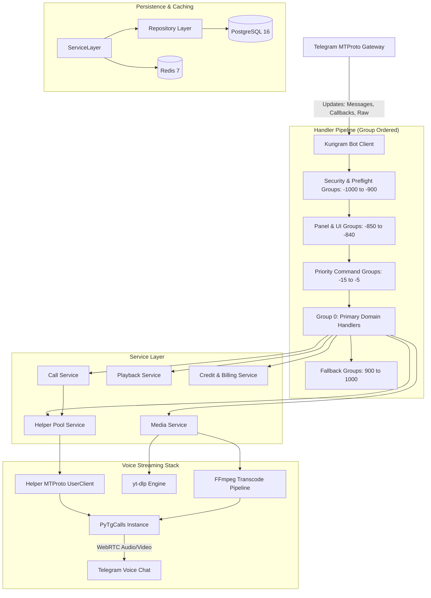
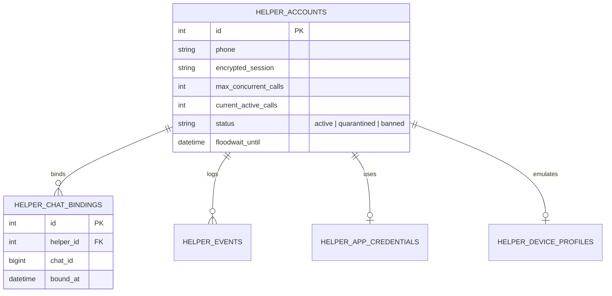
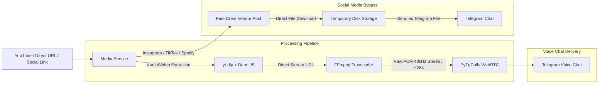

# System Architecture and Design

> **Status:** Canonical Architectural Reference  
> **Target Environment:** Python 3.12+ | PostgreSQL 16 | Redis 7 | Kurigram | PyTgCalls  
> **Alembic Revision Head:** `0039_hot_seat`

---

## 1. Executive Overview

The **Telegram Voice Chat Music & Video Player Bot** is an enterprise-grade, multi-tenant Software-as-a-Service (SaaS) platform designed for real-time audio and video streaming into Telegram Voice Chats (Group Calls).

### Key Architectural Pillars
- **Layered Service-Oriented Architecture (SOA):** Clean decoupling between incoming Telegram event handling, domain business logic, data persistence, and low-level media transport.
- **Multi-Tenant Subscription & Credit System:** Role hierarchy spanning Developer, Owner, Sudo, Group Admin, and VIP roles, governed by an idempotent credit deduction engine.
- **Multi-Helper Pool Engine:** Distributed pool of Telegram user accounts (helpers) orchestrated to join voice chats dynamically, load-balance streaming sessions, and circumvent Telegram MTProto concurrency limits.
- **Robust Event Routing:** Explicit group-ordered handler topology enforcing security invariants, preventing listener starvation, and isolating raw MTProto observers from typed callback pipelines.
- **Resilient Distributed State:** PostgreSQL 16 as the persistent source of truth, backed by Redis 7 for sub-millisecond caching, transient session states, rate limiting, and distributed locking.

---

## 2. Technology Stack & Runtime Dependencies

| Component | Technology | Version / Spec | Responsibility |
|---|---|---|---|
| **Language** | Python | 3.12+ | Core runtime |
| **Telegram MTProto Client** | Kurigram (`kurigram`) | 2.2.24 (Pyrogram fork) | Bot & User MTProto gateway, update dispatch |
| **Voice Chat Engine** | `py-tgcalls` | Latest (`ntgcalls` C wheel) | WebRTC / voice chat media streaming |
| **Database** | PostgreSQL | 16 | ACID persistent storage |
| **ORM / Async Driver** | SQLAlchemy & asyncpg | 2.0+ & 0.29+ | Async connection pooling, queries, unit-of-work |
| **Migrations** | Alembic | 1.13+ | DDL migrations and schema evolution |
| **Cache & Locks** | Redis | 7.x (`redis.asyncio`) | TTL caches, locks (`SET NX PX`), FSM state |
| **Scheduler** | APScheduler | 3.10+ | Async cron jobs (daily deduct, health probes) |
| **Media Extraction** | `yt-dlp` | Latest | Stream metadata & URL extraction (Deno JS engine) |
| **Media Transcoding** | FFmpeg | 6.0+ / 7.0+ | Audio/Video raw PCM and transcode pipelines |
| **Security & Encryption** | Cryptography (`Fernet`) | 42.0+ | Session string and vendor token encryption |
| **Logging** | Loguru | 0.7+ | Structured logging with secret masking |

---

## 3. Runtime Architecture & Data Flow



---

## 4. Startup Sequence & Lifecycle Management

The process entrypoint is `app/main.py::main`. Startup executes deterministically through the following phases:

```mermaid
sequenceDiagram
    participant OS as System / Docker
    participant Main as app.main
    participant Cfg as Settings & Config
    participant DB as PostgreSQL Engine
    participant Handlers as Handler Registry
    participant Sched as APScheduler
    participant TG as Telegram API

    OS->>Main: python -m app.main
    Main->>Cfg: Load settings (config.env)
    Main->>DB: init_db() & schema readiness preflight
    Note over DB: Verifies Alembic Head (0039_hot_seat)<br/>Enforces DB_ALLOW_CREATE_ALL=false
    Main->>DB: bootstrap_developer_owners()
    Main->>Handlers: register_all(bot, call_py)
    Note over Handlers: Registers 40+ modules across priority groups
    Main->>Sched: setup_scheduler()
    Main->>TG: bot.start()
    Main->>Handlers: apply_callback_safety_wrapper()
    Note over Main: System fully active; listens for SIGINT/SIGTERM
    OS->>Main: SIGINT / SIGTERM
    Main->>Sched: scheduler.shutdown()
    Main->>TG: helper_pool.stop_all() & bot.stop()
    Main->>DB: engine.dispose()
```

### Preflight Gates
1. **Schema Readiness Check:** In production, the bot refuses to boot if the database schema does not match the canonical Alembic migration head (`0039_hot_seat`). Dynamic table creation (`Base.metadata.create_all`) is strictly disabled to guarantee zero schema drift.
2. **Developer Root Bootstrap:** Ensures the primary developer ID from configuration exists in the database with unrestricted system permissions.
3. **Global Callback Safety Wrapper:** Post-startup, wraps every registered callback query handler with automatic error logging and suppression of benign `MessageNotModified` Telegram errors.

---

## 5. Handler Architecture & Priority Group Routing Topology

Kurigram/Pyrogram processes incoming updates using an ascending **group-ordered** dispatch mechanism:
- Groups run sequentially from lowest integer to highest.
- Within any group, the first handler whose filter evaluates to `True` executes.
- After an executing handler returns normally, dispatch **breaks** to the next group unless `ContinuePropagation` is raised.
- If a handler raises `StopPropagation`, dispatch terminates immediately across all subsequent groups.
- **Filter Evaluation Caveat:** Returning `False` from a filter does not "deny" an event; it merely causes the dispatcher to skip that handler and continue scanning.

### The "Route-First, Guard-Inside" Principle
To prevent permission denial from silently falling through into generic catch-alls or unknown callback errors:
1. **Identity Filters Only:** Visible callback buttons MUST register with exact identity regexes (e.g., `filters.regex("^dev:status$")`). Never place deny-capable filters (such as `dev_filter` or `private_chat_filter`) in the handler registration decorator.
2. **In-Handler Guards:** Authorizations and context checks are performed explicitly inside the handler body (using `@developer_only`, `_guard_private`, or `_guard_stale`). Denials respond with an explicit alert (`t(lang, "common.errors.no_access")`), never a silent skip.
3. **Dedicated Group for Raw Handlers:** Filterless `RawUpdateHandler` instances match all update types (including callbacks). They are strictly isolated in `CALL_SECURITY_RAW_GROUP = -900` so they never block typed handlers in group 0.

### Complete Priority Group Topology

| Group ID | Constant Name | Handlers / Roles | Purpose |
|---|---|---|---|
| **-1000** | `LANG_BIND_GROUP` | i18n Context Middleware | Detects user/chat language and attaches translation helper |
| **-995** | `GLOBAL_BAN_GROUP` | Global Ban Guard | Drops updates from globally blacklisted user IDs |
| **-990** | `CALLBACK_TRACE_GROUP` | Diagnostic Callback Tracer | Diagnostic logging and telemetry for callback routing |
| **-980** | `PYROMOD_CALLBACK_GROUP` | Pyromod Interactive Listeners | Intercepts callbacks during multi-step conversational wizards |
| **-950** | `BOT_DISABLED_CALLBACK_GROUP` | Maintenance Mode Guard | Intercepts actions when the bot is toggled off by Developer |
| **-900** | `CALL_SECURITY_RAW_GROUP` | Raw Voice Call Observer | Captures MTProto `GroupCall` participant events; isolated from typed callbacks |
| **-850** | `GROUP_PANEL_CALLBACK_GROUP` | Group Panel Navigation | Handles `nav:back` and `wz:home` within group chats |
| **-845** | `HELP_CALLBACK_GROUP` | Help Center Navigation | Help menu routing and sub-panels |
| **-840** | `PANEL_CALLBACK_GROUP` | Terminal Panel Callbacks | Developer, Owner, Sudo, and Analytics panels (`StopPropagation`) |
| **-90** | `HELPER_OTP_INPUT_GROUP` | Helper Wizard OTP Listener | Private text input listener for helper account login code |
| **-89** | `HELPER_PROXY_INPUT_GROUP` | Helper Wizard Proxy Listener | Private text input listener for helper account proxy configuration |
| **-15** | `PRIORITY_COMMAND_GROUP` | High-Priority Text Commands | Playback (`پخش`), credit charge (`شارژ`), role assignment |
| **-10** | `GUARD_GROUP` | Group Installation Guard | Verifies group registration and active credit status |
| **-5** | `FILTER_WORDS_GROUP` | Moderation & Word Filter | Message content screening and auto-deletion |
| **0** | *(Default Group)* | Primary Domain Handlers | Standard commands, media triggers, settings toggles |
| **900** | `GROUP_FAMILY_FALLBACK_GROUP` | Group Panel Family Fallback | Explicit permission error alerts for group panel buttons |
| **1000** | `FALLBACK_CALLBACK_GROUP` | Global Unknown Callback Fallback | Two-tier safety net: known prefix vs unknown callback alert |

---

## 6. Multi-Helper Account Pool Architecture

Telegram MTProto enforces rate limits and limits simultaneous voice call participation per user account. To achieve carrier-grade scalability, this platform employs a dynamic helper account pool.



### 1. Session Storage & Encryption
Helper sessions are stored as Kurigram session strings in PostgreSQL (`helper_accounts.session_string`). All session strings are encrypted using AES-128-CBC via `Fernet` symmetric encryption.
- Encryption key: `HELPER_SESSION_KEY_CURRENT`
- Key rotation support: `HELPER_SESSION_KEY_OLD` allows seamless re-encryption during key rotation.

### 2. Atomic Helper Reservation (`reserve_best_helper`)
When playback starts in a chat:
1. Checks existing binding in `helper_chat_bindings`. If bound and eligible, the assigned helper is reused.
2. If unassigned or overloaded, scans the helper pool for the best candidate:
   - Must be `status = "active"`.
   - `floodwait_until` must be `NULL` or in the past.
   - Must have `current_active_calls < max_concurrent_calls`.
   - Least-recently assigned / lowest active load is preferred.
3. Executes within a database transaction with row-level locks (`SELECT ... FOR UPDATE`) and Redis distributed locks to prevent race conditions during concurrent playback requests.

### 3. Fault Tolerance, Cooldown & Quarantine
- **FloodWait Protection:** If Telegram raises `FloodWait(seconds)` on a helper, the helper is placed in temporary cooldown:
  - Database: `floodwait_until = now() + seconds`
  - Redis: `helper:floodwait:{helper_id}` with TTL = `seconds`.
- **Automatic Quarantine:** If a helper fails to connect or is removed from a group 3 times consecutively, it enters `quarantined` status and an alert is dispatched to the Developer Log Channel.

---

## 7. Media Streaming & Voice Stack (PyTgCalls)



### Playback Transport Mechanics
- **Audio Streaming:** Transcoded on-the-fly to raw PCM (48,000 Hz, 16-bit, 2-channel stereo).
- **Video Streaming:** Transcoded to H.264 video at the configured resolution (`VIDEO_QUALITY` setting: `360p`, `480p`, `720p`).
- **Disk Cache & Eviction:** Downloaded media items are stored in `DOWNLOADS_PATH`. An asynchronous eviction task monitors disk usage against `MEDIA_CACHE_MAX_GB` and trims down to `MEDIA_CACHE_TARGET_GB` via LRU heuristics.
- **Fast-Creat Social Media Direct Send:** If a user requests an Instagram, TikTok, or Spotify URL via `پخش <link>`, the bot bypasses the voice call and instead fetches the media through the Fast-Creat provider pool, sending the file directly to the chat.

---

## 8. Persistence, Caching & Distributed Locks

### Source of Truth Hierarchy
1. **PostgreSQL 16 (Authoritative):** All permanent records: accounts, settings, credits, subscriptions, playlists, ban lists.
2. **Redis 7 (Transient & Cache):**
   - **Settings Cache:** `settings:{chat_id}` (TTL 300s).
   - **Credit Cache:** `credit:{chat_id}` (TTL 300s).
   - **User Roles Cache:** `role:{user_id}` (TTL 600s).
   - **Distributed Locks:** Redis `SET key value NX PX <milliseconds>`. If Redis is temporarily unreachable, transparently falls back to PostgreSQL advisory locks (`pg_advisory_xact_lock`).
   - **Interactive Wizards:** Transient state storage for broadcast wizards, helper OTP logins, and panel pagination.

---

## 9. Security & Invariant Checklist

- [x] **No Plaintext Secrets:** Bot tokens, API hashes, and session strings are masked in logs and encrypted in database columns.
- [x] **Idempotent Billing:** Daily credit deduction uses `last_daily_deducted_on` date column and unique partial indexes to guarantee zero duplicate deductions.
- [x] **Call Security Raw Isolation:** The filterless raw handler for MTProto group call participant updates lives exclusively in group `-900`.
- [x] **Strict i18n Architecture:** Split-only JSON fragments under `app/resources/i18n/` with complete parity between Persian (`fa`) and English (`en`).
