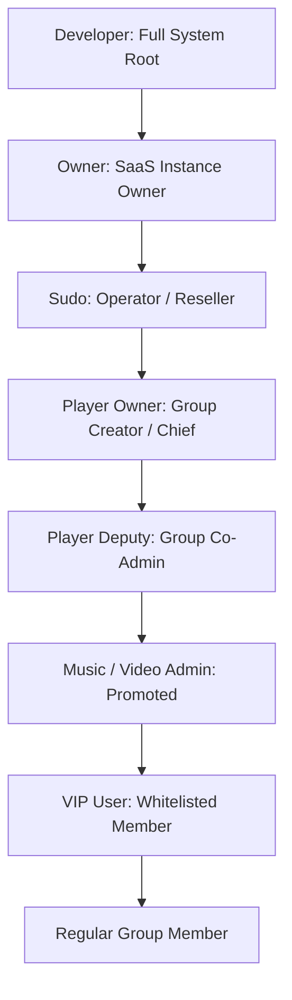

# Commands and Admin Panels Reference

> **Status:** Canonical Command Catalog & UI Reference  
> **Audience:** Operators, Admins, Developers, and Users  
> **i18n Architecture:** All UI buttons and responses render dynamically from `app/resources/i18n/`

---

## 1. Role & Permission Ladder

The bot implements a strict, multi-tiered role hierarchy with role inheritance and privilege isolation.



### Role Capabilities Matrix

| Role | Scope | Key Capabilities | Access Entrypoint |
|---|---|---|---|
| **Developer** | Global System | Helper pool management, global rates, monthly invoices, system reloads, Fast-Creat token pool, database administration | `/dev` or private menu |
| **Owner** | Instance | Sudo user management, instance sales, bulk invoices, broadcast wizard, force-join channels, blacklist | `/owner` or private menu |
| **Sudo** | Assigned Groups | Group credit allocation, group search, renewal reminders, leave group triggers | `/sudo` or private menu |
| **Player Owner** | Single Group | Player configuration, manager & deputy assignments, group playlist reset | In-group commands & panel |
| **Player Deputy** | Single Group | Add/remove promoted managers, view manager lists | In-group commands |
| **Music Admin** | Single Group | Control audio playback (skip, pause, volume, loop, seek) | In-group commands |
| **Video Admin** | Single Group | Control video streaming | In-group commands |
| **VIP User** | Single Group | Bypass group playback lock (`security_call_enabled`) | In-group commands |
| **Regular User** | Single Group | Request songs if public playback is enabled in settings | In-group commands |

---

## 2. Playback & Voice Streaming Commands

### Core Slash Commands

| Command | Arguments | Roles | Description |
|---|---|---|---|
| `/play` | `<query or URL>` | Admin / VIP / All | Plays audio in group voice chat. Accepts song names, direct audio URLs, or YouTube links. |
| `/vplay` | `<query or URL>` | Admin / VIP / All | Streams video into group voice chat. Accepts YouTube links or direct MP4 URLs. |
| `/pause` | — | Music Admin+ | Pauses the current voice chat stream. |
| `/resume` | — | Music Admin+ | Resumes a paused stream. |
| `/skip` | — | Music Admin+ | Skips the current track to the next queue item. |
| `/stop` | — | Music Admin+ | Stops playback, clears the active queue, and leaves voice chat. |
| `/replay` | — | Music Admin+ | Restarts the currently playing track from the beginning. |
| `/seek` | `<seconds or mm:ss>` | Music Admin+ | Seeks playback to the specified time offset. |
| `/volume` | `<1-200>` | Music Admin+ | Adjusts voice chat stream volume. |
| `/speed` | `<0.5-2.0>` | Music Admin+ | Adjusts playback speed. |
| `/queue` | — | All | Displays the current playlist queue with pagination. |
| `/loop` | `<on \| off \| count>` | Music Admin+ | Toggles single-track repeat or queue loop mode. |
| `/shuffle` | — | Music Admin+ | Shuffles remaining items in the queue. |

### Social Media Direct Play (Fast-Creat)
When users send social media links with the `پخش` or `play` trigger, the bot intercepts the request, downloads the media via the Fast-Creat vendor API, and sends it directly to the chat as a media file without entering the voice call:

```text
پخش https://www.instagram.com/reel/XXXXXXXX/
play https://www.tiktok.com/@user/video/XXXXXXXX
پخش https://open.spotify.com/track/XXXXXXXX
```

---

## 3. Slash-Free Persian & English Group Commands

The bot supports natural language Persian commands as well as concise English equivalents. These commands can be used with username mentions, numeric IDs, or via reply.

### 1. Group Installation & Lifecycle

| Persian Command | English Command | Minimum Role | Action |
|---|---|---|---|
| `افزودن موزیک` / `نصب موزیک` | `Addm` / `AddMusic` | Sudo / Developer | Registers the group into the bot management system. |
| `حذف نصب موزیک` / `حذف نصب پلیر` | `RemM` / `RemMusic` / `RemPlayer` | Sudo / Developer | Uninstalls the bot from management, clears settings, keeps bot in chat. |
| `خروج موزیک` / `ترک گروه موزیک` | `LeaveM` / `LeaveMusic` | Sudo / Developer | Clears group settings and forces bot & helpers to leave the chat. |
| `افزودن کمکی موزیک` / `افزودن کمکی پلیر` | `AddhelperMusic` / `AddhelperM` | Music Admin+ | Dispatches an available helper account from the pool to the chat. |

### 2. Credit & Subscription Management

| Persian Command | English Command | Minimum Role | Action |
|---|---|---|---|
| `شارژ موزیک 100` / `شارژ پلیر 100+` | `ChargeMusic +100` / `ChargePlayer 100` | Sudo+ | Adds 100 days of active subscription credit to the group. |
| `شارژ موزیک 100-` | `ChargeMusic -100` | Sudo+ | Deducts 100 days of subscription credit from the group. |
| `شارژ پلیر نامحدود` | `ChargePlayer Unlimit` | Developer | Sets group credit to permanent unlimited status (`-1`). |
| `شارژ موزیک -1001234567890 20` | `ChargeMusic -1001234567890 +20` | Sudo+ (in PM) | Remotely credits target group `-1001234567890` with 20 days. |
| `اعتبار موزیک` / `اعتبار پلیر` | `MusicExpire` / `ExpirePlayer` | All | Displays remaining credit days and expiration date for the group. |

### 3. Role Assignment: Player Owners (`PlayerOwner`)

| Persian Command | English Command | Minimum Role | Action |
|---|---|---|---|
| `ارتقا مالک موزیک` / `افزودن مالک پلیر` | `AddOwnerM` / `SetOwnerMusic` | Sudo / Group Creator | Promotes target user to Player Owner. |
| `عزل مالک موزیک` / `حذف مالک پلیر` | `RemOwnerMusic` / `DemOwnerpPlayer` | Sudo / Group Creator | Demotes user from Player Owner. |
| `لیست مالک پلیر` / `لیست مالکان موزیک` | `OwnerListM` / `OwnerListMusic` | Group Admin+ | Displays the list of current Player Owners. |
| `پاکسازی لیست مالک موزیک` | `ClearOwnerListM` / `ClearOwnerListMusic` | Group Creator / Sudo | Clears all Player Owners in the group. |

### 4. Role Assignment: Player Deputies (`PlayerDeputy`)

| Persian Command | English Command | Minimum Role | Action |
|---|---|---|---|
| `ارتقا معاون موزیک` / `افزودن معاون پلیر` | `AddDeputyM` / `SetDeputyMusic` | Player Owner+ | Promotes target user to Player Deputy. |
| `عزل معاون موزیک` / `حذف معاون پلیر` | `RemDeputyMusic` / `DemDeputypPlayer` | Player Owner+ | Demotes user from Player Deputy. |
| `لیست معاون پلیر` / `لیست معاونین موزیک` | `DeputyListM` / `DeputyListMusic` | Group Admin+ | Displays the list of current Player Deputies. |
| `پاکسازی لیست معاون موزیک` | `ClearDeputyListM` / `ClearDeputyListMusic` | Player Owner+ | Clears all Player Deputies in the group. |

### 5. Role Assignment: Music Managers & Promoted Admins

| Persian Command | English Command | Minimum Role | Action |
|---|---|---|---|
| `ترفیع موزیک` / `ارتقا مقام پلیر` | `PromoteM` / `PromoteMusic` | Player Deputy+ | Promotes a user to Music Admin (permanently or temporarily). |
| `عزل موزیک` / `عزل مقام پلیر` | `DemoteM` / `DemoteMusic` | Player Deputy+ | Demotes user from Music Admin. |
| `لیست مدیر موزیک` / `لیست مدیران پلیر` | `ModListM` / `ModListMusic` | Group Admin+ | Displays promoted managers (permanent first, then temporary with time remaining). |
| `پاکسازی لیست مدیران موزیک` | `ClearModListM` / `ClearModListMusic` | Player Owner+ | Clears all promoted managers in the group. |
| `پیکربندی پلیر` / `پیکربندی موزیک` | `ConfigPlayer` / `ConfigMusic` | Player Owner+ | Resets manager list to synchronize with current Telegram group admins. |

---

## 4. Interactive Admin Panels

All administrative panels utilize inline keyboards with responsive callbacks and explicit state validation.

### 1. Developer Panel (`/dev` | `dev:home`)
- **System Overview:** Host CPU, memory usage, disk storage, active voice streams, connected helpers.
- **Helper Pool Controller:**
  - View all registered helpers, session status, and active calls.
  - Launch OTP Login Wizard to add helper accounts interactively.
  - Quarantine / Unquarantine or remove helpers.
  - Configure per-helper SOCKS5/MTProto proxies.
- **Fast-Creat Token Pool (`fct:home`):**
  - Manage API token pools for Instagram, TikTok, and Spotify providers.
  - Enable, disable, or delete tokens with one-time confirmation.
- **Billing & Rate Configuration:**
  - Adjust base subscription rate, music rate, and video rate.
  - Generate and review monthly customer invoices.
- **Global Moderation:**
  - Manage global bans (`global_bans`).
  - Configure global filter words (`filter_words`).
  - Bot maintenance toggle (`bot_enabled`).

### 2. Owner Panel (`/owner` | `own:home`)
- **Sudo Manager:** Add, list, or revoke Sudo operator privileges.
- **Broadcast Wizard (`bcw:start`):**
  - Multi-step interactive broadcast creation.
  - Target selection: Groups, Channels, or Private Users.
  - Scheduling: Immediate send, delayed send, or recurring cron broadcast.
- **Force Join Controller (`fm:panel`):**
  - Require users to join specific sponsor channels before using the bot.
  - View channel subscriber status and toggle enforcement.
- **Instance Sales & Invoices:** View revenue, active group licenses, and renewals.

### 3. Sudo Panel (`/sudo` | `sudo:home`)
- **Group Management:** Search active groups, inspect expiration dates, view group details.
- **Credit Assignment:** Increase or decrease group subscription days with single-tap increments (`+30`, `+90`, `+365`).
- **Expiring Groups:** View list of groups whose subscriptions expire within 7 days.

### 4. Group Settings Panel (`/panel` | `grp:home`)
- **Media Toggles:**
  - Audio playback enable/disable.
  - Video streaming enable/disable.
  - Direct file downloads enable/disable.
- **Default Media Type:** Switch preferred default mode between Audio and Video.
- **Auto Clean (`grp:auto_clean`):** Automatically delete command trigger messages to keep group chat clean.
- **Call Security (`grp:callsec`):**
  - Enable per-chat voice call participant security.
  - Minimum account age gate (e.g., accounts younger than 7 days).
  - Automated mute or report for unauthorized speakers.
